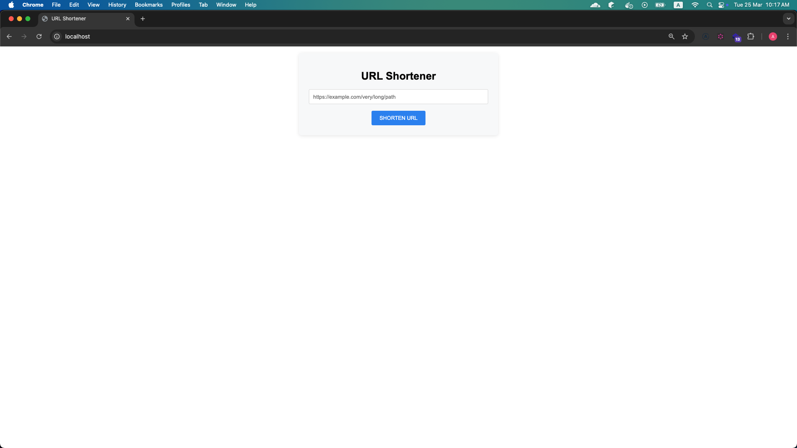

# Programming Test Solutions (rel:202501)

โปรเจคนี้ประกอบด้วยโซลูชันสำหรับโจทย์ข้อ 3 (URL Shortening Service) และข้อ 5 (Generic Front-end and Back-end)

## โครงสร้างโปรเจค

```
├── question-1-turtle-walking/
    ├── core (instance ทั้งหมดที่เกี่ยวข้องกับ Matrix)
    ├── files (file สำหรับกำหนด Metrix หรือ Params)
    ├── index.ts (main process)
├── question-3-url-shortener/
    ├── docs (เอกสารที่เกี่ยวข้อง)
    ├── service (API service)
└── question-5-fullstack/
    ├── backend/
    └── frontend/
```

## การเริ่มต้นใช้งาน
```bash
# Turtle walking
cd question-1-turtle-walking
# Excute 1.1
make one
# Excute 1.2
make two
```
```bash
# URL Shortener
cd question-3-url-shortener/service
docker-compose up -d
# URL Shortener: http://localhost:80
```
```bash
cd question-5-fullstack
docker-compose up -d
# User Management(Frontend): http://localhost:3000
# User Management(Backend): http://localhost:7777
```

## Github Repository
[Github Repository](https://github.com/aphisit-ths/programing-testing-202501)

## ภาพหน้าจอ
### URL-shortener


### User Management Service


## รายละเอียดแต่ละโปรเจค
- [Turtle Walking README](./question-1-turtle-walking/README.md)
- [URL Shortener README](./question-3-url-shortener/README.md)
- [User Management README](./question-5-fullstack/README.md)
