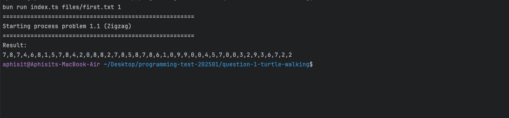
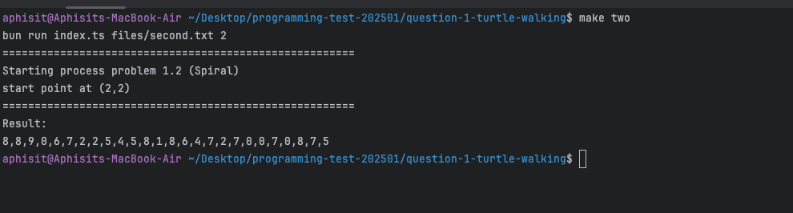

# Question-1-turtle-walking

I just finished for 2 of 3 

### Project structure

```
├── question-1-turtle-walking/
    ├── core (instance ทั้งหมดที่เกี่ยวข้องกับ Matrix)
    ├── files (file สำหรับกำหนด Metrix หรือ Params)
    ├── index.ts (main process)
```

## How to execute program
Zigzag problem (1.1)
```bash
bun run index.ts files/first.txt 1
#or
make one
```

Spiral problem (1.2)

```bash
bun run index.ts files/two.txt 2
#or
make two
```

## Screenshot
Zigzag problem (1.1)

Spiral problem (1.2)
