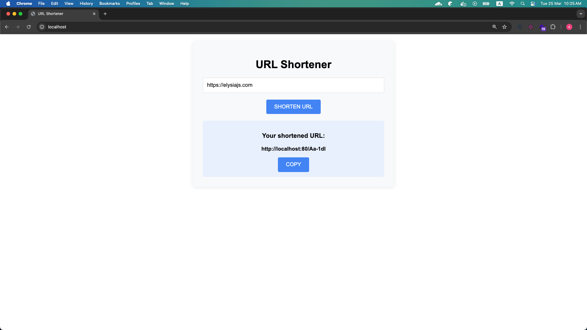
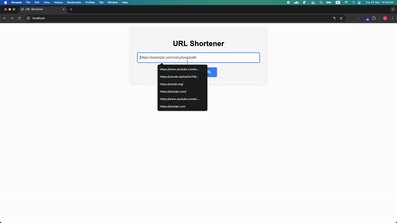
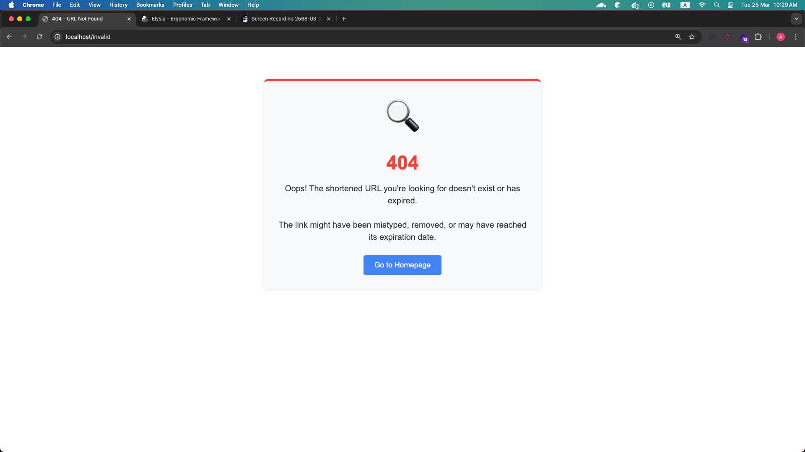

# บริการย่อ URL (URL Shortening Service)

บริการย่อ URL พัฒนาด้วย Bun.js, Elysia.js และ SQLite

## เทคโนโลยีที่ใช้
- **Runtime**: Bun.js
- **Framework**: Elysia.js
- **Database**: SQLite
- **Caching**: LRU-Inmemory
- **Containerization**: Docker

## การติดตั้ง

```bash
# ติดตั้ง dependencies
bun install

# เตรียมฐานข้อมูล
touch mydb.sqlite
bun run db:migrate
```

## การเริ่มต้นใช้งาน

```bash
# Development mode
bun run dev

# หรือใช้ Docker
docker build -t url-shortener .
docker run -p 80:80 url-shortener

# หรือ Docker-compose 
docker-compose up --build -d
```

## API Endpoints

- **GET /** - แสดงหน้าเว็บพร้อมฟอร์มสำหรับย่อ URL
- **POST /shorten** - สร้าง URL สั้น
- **GET /:id** - เปลี่ยนเส้นทางไปยัง URL เดิม
- **DELETE /:id** - ปิดใช้งาน URL สั้น
- **POST /:id/reactivate** - เปิดใช้งาน URL สั้น
- **GET /urls** - แสดงรายการ URL ทั้งหมด

## ภาพหน้าจอ

### Homepage

### Shorten URL

### Invalid

