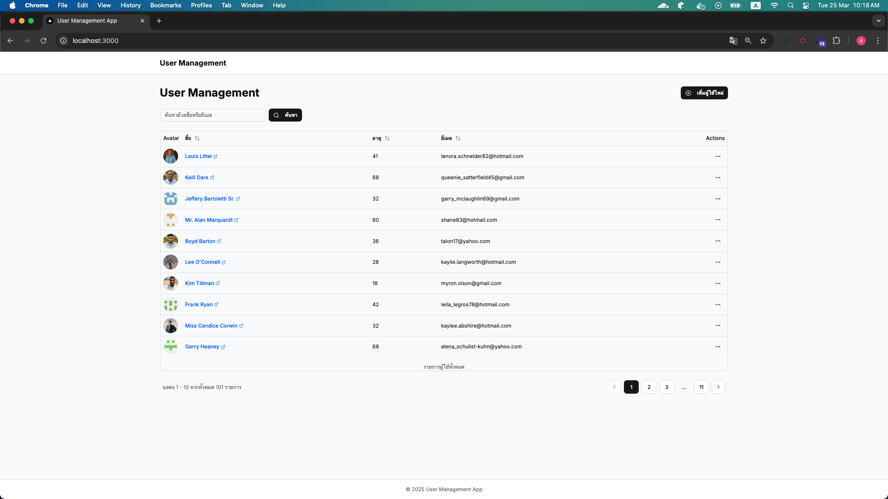
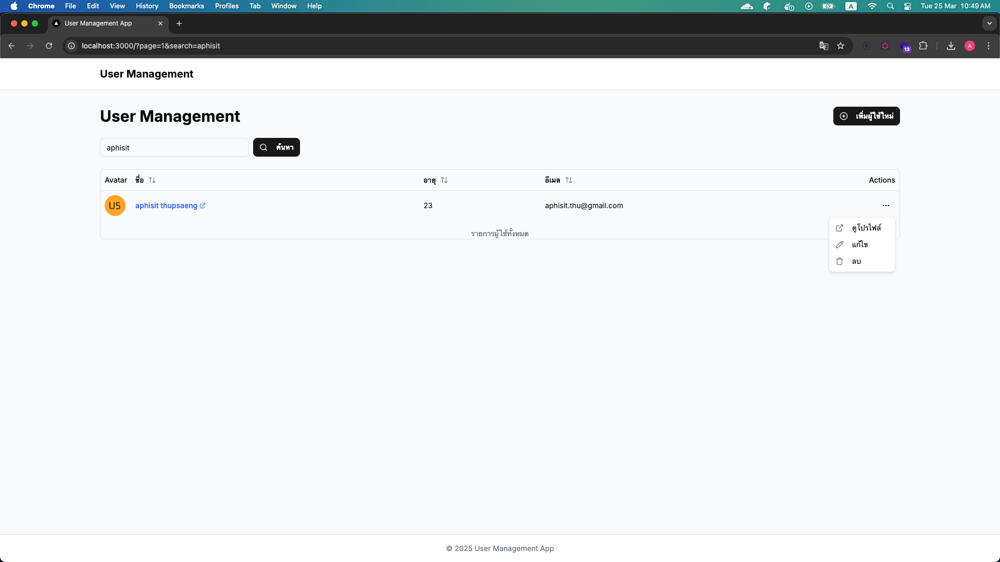
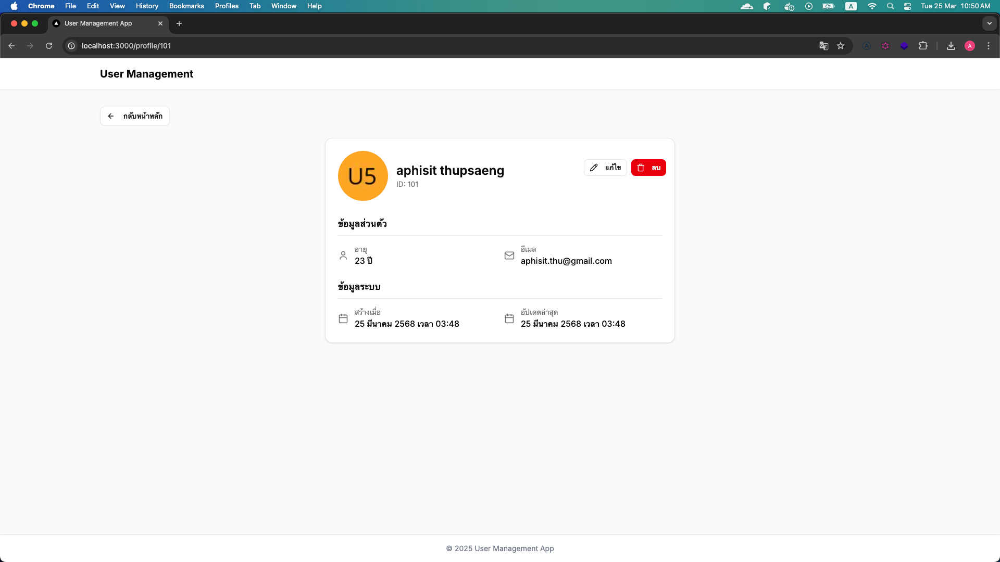

# Full-stack User Management Application

ระบบจัดการข้อมูลผู้ใช้แบบครบวงจร ประกอบด้วย RESTful API Backend และ Next.js Frontend พัฒนาด้วย Bun, Elysia.js, SQLite และ Next.js

## โครงสร้างโปรเจค

```
├── backend/              # RESTful API พัฒนาด้วย Elysia.js และ Bun
└── frontend/             # Next.js Frontend Application
```

## สาธิตการทำงานของระบบ
[คลิกที่นี่เพื่อดูวิดีโอสาธิตการทำงาน](https://www.youtube.com/watch?v=tM-0eIT026E)

ใช้ Docker Compose เพื่อรันทั้ง backend และ frontend พร้อมกัน:

```bash
# สร้างและรัน container
docker-compose up -d

# Backend API: http://localhost:7777
# Frontend: http://localhost:3000
```
## สาธิตการทำงานของระบบ


## การรันแต่ละส่วนแยกกัน

### Backend

```bash
cd backend

# ติดตั้ง dependencies
bun install

# รัน database migrations
bun run db:migrate

# รัน server ในโหมด development
bun run dev
```

### Frontend

```bash
cd frontend

# ติดตั้ง dependencies
npm install
# หรือ
yarn install

# รัน development server
npm run dev
# หรือ
yarn dev
```

## ภาพหน้าจอ





## รายละเอียดเพิ่มเติม

- [Backend README](./backend/README.md)
- [Frontend README](./frontend/README.md)