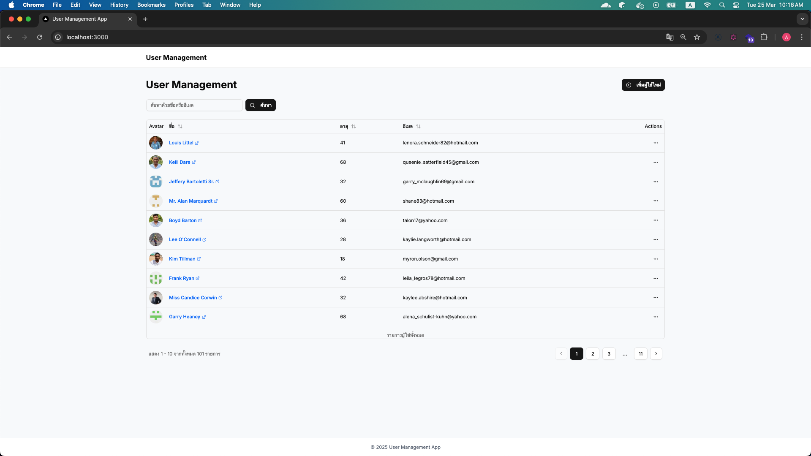
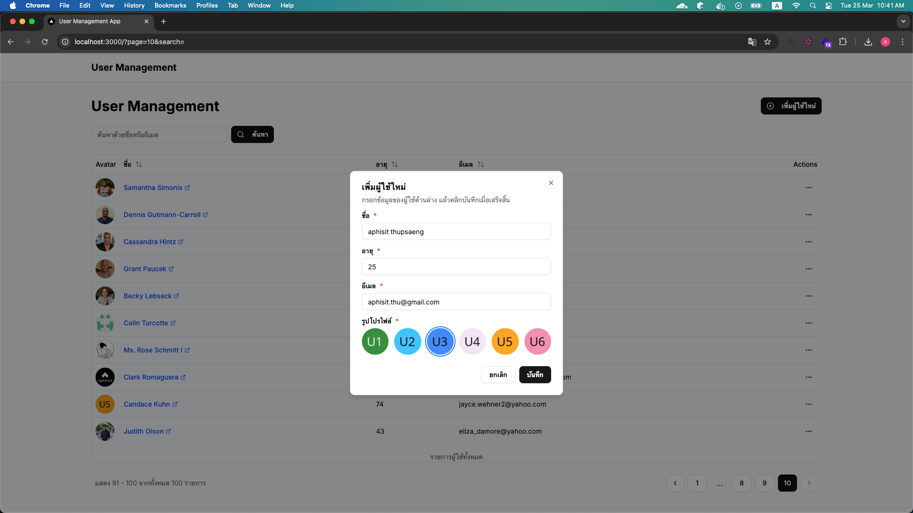
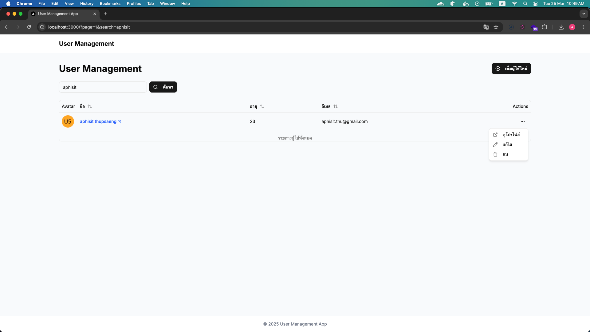
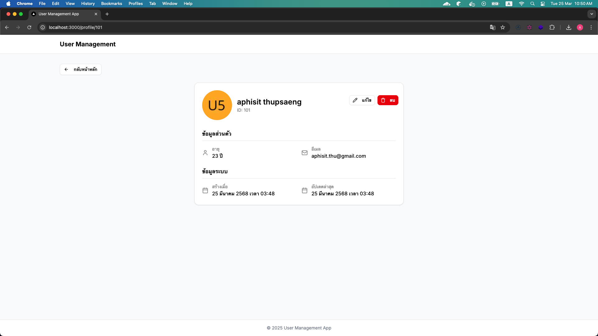

# User Management Frontend

Frontend application สำหรับจัดการข้อมูลผู้ใช้ พัฒนาด้วย Next.js

## ฟีเจอร์หลัก
- แสดงรายการผู้ใช้ในรูปแบบตาราง
- ค้นหาผู้ใช้ด้วยชื่อหรืออีเมล
- เพิ่ม/แก้ไข/ลบข้อมูลผู้ใช้
- การแบ่งหน้า (Pagination)

## การติดตั้ง

```bash
# ติดตั้ง dependencies
npm install
# หรือ
yarn install
```

## การเริ่มต้นใช้งาน

```bash
# Development mode
npm run dev

# Build สำหรับ production
npm run build
npm run start
```

## การเชื่อมต่อกับ Backend
Frontend ถูกตั้งค่าให้เชื่อมต่อกับ backend API ที่ http://localhost:7777

## ภาพหน้าจอ



